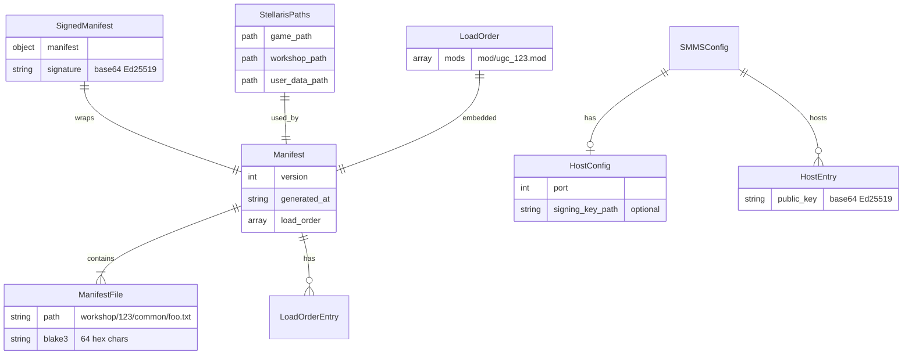

# SMMS Data Model

Domain entities and wire format (as built).

## Diagram



## Wire Format (JSON)

Unsigned manifest response:

```json
{
  "version": 1,
  "generated_at": "2026-02-22T15:30:00Z",
  "files": {
    "workshop/1234567890/common/buildings.txt": "af3b...",
    "local/my_mod/common/foo.txt": "b2c1..."
  },
  "load_order": ["mod/ugc_1234567890.mod", "mod/my_mod.mod"]
}
```

Signed manifest response:

```json
{
  "manifest": {
    "version": 1,
    "generated_at": "2026-02-22T15:30:00Z",
    "files": {
      "workshop/1234567890/common/buildings.txt": "af3b...",
      "local/my_mod/common/foo.txt": "b2c1..."
    },
    "load_order": ["mod/ugc_1234567890.mod", "mod/my_mod.mod"]
  },
  "signature": "base64-ed25519-signature"
}
```
