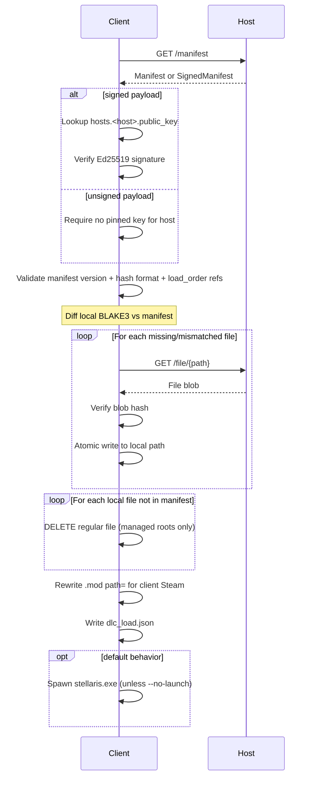

# SMMS Sync Sequence

Client `fetch` flow: retrieve, validate, diff, transfer, apply.

## Diagram

## Notes

- Host does not push; client pulls only
- Delete step removes ghost/orphan files within managed mod roots
- Transport is HTTP; signing provides authenticity only when keys are configured
