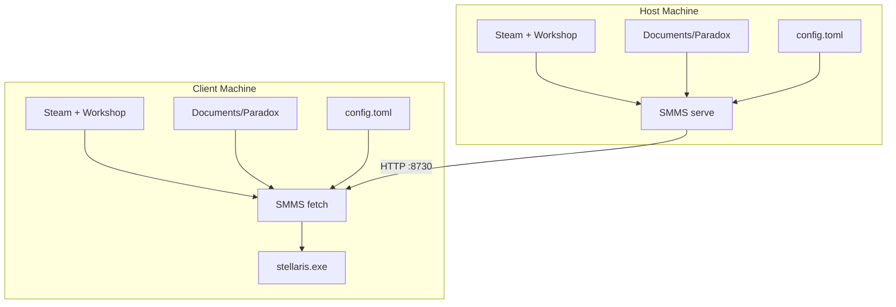

# SMMS System Overview

High-level components and data flow (as built).

## Diagram

## Components

- **SMMS serve**: path resolver, playset extractor, manifest generator, optional manifest signer, HTTP server (`/manifest`, `/file/*path`)
- **SMMS fetch**: manifest verifier, diff engine, file fetcher, orphan cleanup, descriptor rewriter, `dlc_load.json` writer, optional launcher bypass
- **Steam + Workshop**: `libraryfolders.vdf`, `workshop/content/281990`
- **Documents/Paradox**: `mod/`, `dlc_load.json`
- **config.toml**:
  - host: paths, port, optional `signing_key_path`
  - client: host key pinning via `[hosts.<host>].public_key`
